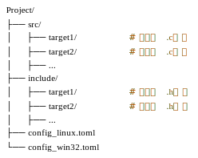

# 构建描述说明

Ruxgo 选择 TOML 文件格式进行构建描述。这是一个旨在易于阅读和编写的声明性文件格式，特别适用于 RuxOS 的构建配置需求。

在具体实现方面，Ruxgo 采用 `config_<platform>.toml` 文件来根据不同的平台配置项目。例如，针对 Linux 平台采用 `config_linux.toml` 文件，针对 Windows 平台则采用 `config_win32.toml` 文件。下图是 Ruxgo 的源代码文件组织示意：

    

