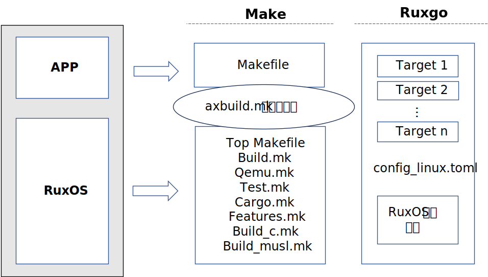

# Ruxgo ​设计目标

Ruxgo 旨在为 RuxOS 提供一个构件化支持、高性能、用户友好且生态完善的构建系统。其开发专注于满足 RuxOS 的组装构建需求，同时也支持广泛的类 Unix 系统及 Windows 系统上基于 C/C++ 开发的应用程序。下图是改用 Ruxgo 构建应用程序的设计示意，整个构建描述只需要一个 Toml 文件：

Ruxgo 的具体设计目标包括：

（1）对 RuxOS 的构件化支持：

Ruxgo 将提供更细粒度的构件和依赖管理能力，支持复杂配置的灵活性，减少手动干预。通过自动化构建流程，Ruxgo 将能够根据应用需求自动选择和配置所需组件，从而提高构建过程的效率。

（2）对应用程序的构件化支持：

为了应对应用程序在开发和移植过程中的挑战，Ruxgo 将支持应用程序的功能分解与组装。它将允许应用程序仅包含对于在 RuxOS 上运行所必需的功能模块，同时提供必要的接口来适配和集成系统库和函数调用，确保应用程序的兼容性和性能。

（3）简洁明了的构建描述：

Ruxgo 的设计理念核心在于提升用户体验，旨在通过简洁明了的构建描述文件和易于理解的 API 接口，减少软件开发人员在构建过程中的负担，从而降低学习曲线。这样，软件开发人员能够更多地专注于源代码的编写和创新，而非耗费大量时间和精力在理解和使用构建工具上。 

（4）高性能的构建:

Ruxgo 旨在最小化自身的构建系统开销，以实现快速的响应。同时采用多种优化策略，包括构件内部和构件间的并行编译和增量编译等，以实现在各种计算环境下的高效构建，特别是资源受限的设备上。 

（5）有效的构件包管理:

Ruxgo 将实现 RuxOS 主干构件和功能构件的远程仓库存储，以便于按需下载和集成，而非在本地存储整个代码库。远程存储机制允许应用程序只获取所需部分，减少本地存储占用，从而加快 Unikernel 镜像的创建过程。此外，相关构件可在远程独立维护和更新，有助于提高系统整体的构建效率和灵活性。