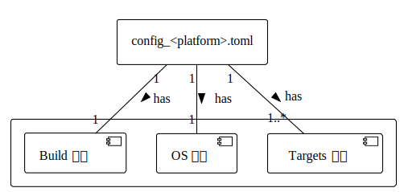

# TOML 文件设计

Ruxgo 的 TOML 构建描述文件主要包含三个核心组件：Build 组件、Targets 组件和 OS 组件。如下图所示：

    

各个组件的具体功能和配置项描述如下：

### Build 组件：

定义构建过程中的基本配置，如编译器的类型和应用程序可执行文件的路径。具体包含以下字段：

- `compiler`: 指定使用的编译器类型。例如，对于 GCC 编译器，此字段值为 "gcc"；对于 Clang 编译器，此字段值为 "clang"。

- `app`: 指定应用程序可执行文件的路径。

通过在 Build 组件中指定适当的编译器，如 GCC 或 Clang，Ruxgo 能够适配不同的开发环境和平台。同时，Build 组件还允许直接指定应用程序的可执行文件路径，以支持预编译的二进制文件的集成和部署。

### Targets 组件：

定义应用程序的构建目标和相关配置。在 Targets 组件中，每个目标可以是一个库、一个可执行文件或其它类型的构建产物。一个配置文件中可以定义多个应用程序构建目标（Target），每个构建目标都包含以下字段：

- `name`: 指定目标的名称。对于动态链接库（"dll"）类型的目标，命名需 "lib_" 前缀开头。

- `src`: 指定目标源代码的根路径。Ruxgo将递归处理该路径下的所有源文件。

- `src_only`(可选): 列举仅需构建的 `src` 中的特定源文件。

- `src_exclude`(可选): 指定在构建过程中需要排除的 src 中的源文件或目录。

- `include_dir`: 指定目标源代码所需的头文件路径。

- `type`: 指定目标的类型，可以是 "static"、"dll"、"object" 或 "exe"，分别代表静态库、动态链接库、中间对象文件和可执行文件。在一个 TOML 文件中，只能有一个 "exe" 目标，但可以有多个其它类型的目标。

- `cflags`: 指定目标中源文件的编译选项。

- `archive`(可选): 如果目标类型是 "static"，可以指定一个归档工具来创建静态库，例如："ar"。

- `linker`(可选): 指定目标的链接工具。如果该值缺失，则根据 `compiler` 选项指定默认值，例如：`compiler` 值为 "gcc"，则目标的默认链接工具为 "gcc"。需要注意的是，当在 RuxOS 上链接所有的库和目标文件时，应当使用 "rust-lld -flavor gnu" 链接工具。

- `ldflags`: 指定目标中源文件的链接选项。

- `deps`: 列出当前构建目标所依赖的其它目标，确保依赖关系的正确处理。

通过为每个构建目标配置源代码路径、头文件路径、编译选项、链接选项以及依赖关系等，Ruxgo 能够精确地控制它们的构建过程，并确保目标之间的依赖关系得到正确处理。

### OS 组件：

OS 组件是一个**可选组件**，用于为应用程序提供在 RuxOS 上运行所需的配置和环境。OS 组件包含以下几个关键字段：

- `name`: 指定操作系统的名称，用于区分不同的操作系统环境配置。

- `services`: 列出操作系统需要提供的服务，以支持特定功能或应用需求。

- `ulib`: 指定用户库，例如："ruxlibc" 或 "ruxmusl"，以便在构建过程中链接。

Ruxgo 提供了基于 QEMU 虚拟机的 x86_64、aarch64 或 riscv64 目标平台的通用配置选项，用户可以根据需求在 [os.platform] 中进行配置，具体字段如下：

- `name`: 指定操作系统在哪个平台上运行，可选项有："x86_64-qemu-q35"、"aarch64-qemu-virt" 和 "riscv64-qemu-virt"。默认值为："x86_64-qemu-q35"。

- `smp`: 指定处理器数量。默认值为："1"。

- `mode`: 指定构建模式。默认值为："release"。

- `log`: 指定日志级别，可选项有："trace"、"debug"、"info"、"warn"和"error"。默认值为："warn"。

- `v`: 指定 verbose 级别，可选项有：""、"1"、"2"。默认值为：""。

对于这些依赖于 QEMU 虚拟机的目标平台，可以在 [os.platform.qemu] 中进一步定义 QEMU 的运行时选项。Ruxgo 提供了一些通用的配置字段，具体如下：：

- `blk`: 指定是否启用 virtio-blk 存储设备。默认值为："n"。

- `net`: 指定是否启用 virtio-net 网络设备。默认值为："n"。

- `graphic`: 指定是否启用 virtio-gpu 显示设备和图形输出。默认值为："n"。

- `debug`: 指定是否启用 gdb 服务，启用后将监听本地 1234 端口。默认值为："n"。

- `disk_img`: 指定虚拟磁盘镜像的路径。默认值为："./disk_img"。

- `v9p`: 指定是否启用 virtio-9p 设备。默认值为："n"。

- `v9p_path`: 指定 virtio-9p 后端的主机路径。默认值为："./"。

- `qemu_log`: 指定是否启用 qemu 日志。默认值为："n"。

- `net_dump`: 指定是否启用网络包转储。默认值为："n"。

- `net_dev`: 指定 qemu 网络设备的后端类型，可选项有："user"或"tap"。默认值为："user"。

- `ip`: 指定虚拟网络设备的 IPv4 地址。默认值为："10.0.2.15"。

- `gw`: 指定虚拟网络设备的网关。默认值为："10.0.2.2"。

- `args`: 指定命令行参数，以逗号分隔。它用于传递特定的变量，如 argc、argv。默认值为：""。

- `envs`: 指定环境变量，键值对之间用逗号分隔。默认值为：""。
