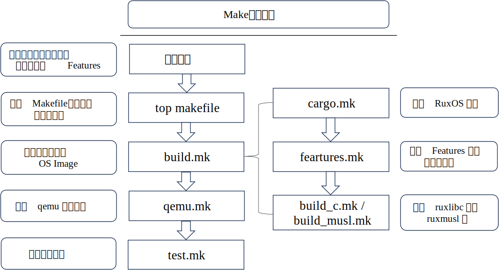

# 为什么 Ruxgo

### RuxOS 早期构建过程的局限性

在 RuxOS 的早期构建实践中，Make 构建工具通过 Makefile 来组织和管理依赖关系和构件层级，如下图所示。在构建开始时，首先需要通过环境变量指定目标架构、目标应用、日志级别以及 Features 等信息，随后通过顶级 Makefile 来启动整体构建流程。其中，build.mk 文件负责完成 OS Unikernel 镜像的构建，而具体的 RuxOS 内核构建、子构件选择、用户库构建则分别由 cargo.mk、features.mk、build_c.mk 和 build_musl.mk来完成。此外，镜像的运行和测试则通过 qemu.mk 和 test.mk 完成。

从上述 RuxOS 的构建过程可以看出，随着系统规模的增长和构件数量的增加，Makefile 的配置变得愈加复杂和庞大。每当新增或修改构件时，都可能需要对 Makefile 进行大量修改，这不仅增加了开发者的负担，也降低了项目的可维护性，同时也存在很多的局限性，具体如下：

（1）缺乏细粒度的构件关系管理：虽然 Make 可以处理基础依赖关系，但并非为解决构件化系统中常见的细粒度依赖问题而设计。在这样的系统中，构件和特性的选择可能高度动态，因此需要更灵活的依赖解决方案。

（2）缺乏对配置的有效支持：Makefile 本身并不是为处理复杂的配置关系而设计的。当 RuxOS 需要灵活的配置来选择和组合不同构件时，开发者常常不得不依靠环境变量或手动编辑 Makefile，这不仅增加了配置过程的复杂度，还产生了环境隔离问题，导致在不同开发环境下重现构建结果存在一定难度。

（3）有限的 Rust 生态系统集成：RuxOS 采用 Rust 语言开发，意味着更倾向于与 Cargo 或 Rust 的生态系统无缝集成。然而，Make 与 Cargo 的集成，如通过单独的 cargo.mk 所示，可能引入额外的复杂性，并且缺乏有效的生态系统利用。

（4）并行构建支持不足：虽然 Make 支持并行构建以加快构建速度，但在复杂的依赖结构下，其并行能力受到限制。例如，构件与构件之间不正确的依赖管理可能导致并行构建出错，从而迫使开发者牺牲构建速度以保证结果的正确性。

### 应用程序移植困难及构件化需求

在 RuxOS 的开发过程中，一个核心目标是实现对广泛类 Unix 应用程序的兼容，旨在通过整合类 Unix 应用生态来扩展 RuxOS 的生态系统。在项目的早期阶段，移植应用程序的一个直接方法是利用应用程序原有的构建工具，来首先生成库文件或中间对象文件，随后将这些文件与 RuxOS 静态库链接，形成最终的 Unikernel 镜像文件。然而，在实际的移植过程以及后期维护、开发过程中，都面临着多重挑战，具体如下：

（1）应用程序的构件化需求：应用程序的构建通常涵盖了众多功能模块，包括核心功能、辅助功能、测试功能以及平台特定功能等，其中许多功能并非在所有场景下都是必需的。在 RuxOS 上移植这些应用时，由于 RuxOS 可能缺少某些系统库或不支持特定的函数调用，直接移植整个应用程序可能会遇到兼容性问题。

（2）应用程序的后期维护需求：一些中等规模的软件项目，其 Makefile 也可能包含数千行代码。在将应用移植到 RuxOS 后，为适配 RuxOS 的构建需求，对原有 Makefile 的调整和修改不可避免，从而加大了应用程序后期维护工作的难度。

（3）应用程序的增量构建需求：在RuxOS上对应用程序进行二次开发或修改时，完整的构建过程可能耗费大量时间，这使得增量构建成为开发过程中的一个必要需求。

### RuxOS构件化管理缺乏

原有 RuxOS 的开发和部署缺乏有效的构件化管理。例如下图所示，RuxOS 的 Modules 模块包含了主干构件和功能构件。主干构件，如 ruxruntime、ruxhal、ruxconfig 等，构成了 RuxOS 的核心，是系统运行不可或缺的部分。相比之下，功能构件如 ruxtask、ruxfs、ruxdriver 等则根据应用程序的具体需求进行选择，这些模块易于变动且高度可配置。

在应用程序构建过程中，开发者首先需要本地下载完整的 RuxOS 代码库，然后基于特定应用的需求，从 Ulib 库、Modules 模块或 Crates 模块中选择必要的构件集合，最终创建 Unikernel 镜像。这一过程在 RuxOS 项目初期或许可行，但随着项目的发展和构件数量的增加，项目的维护难度和本地存储需求也将显著提升。